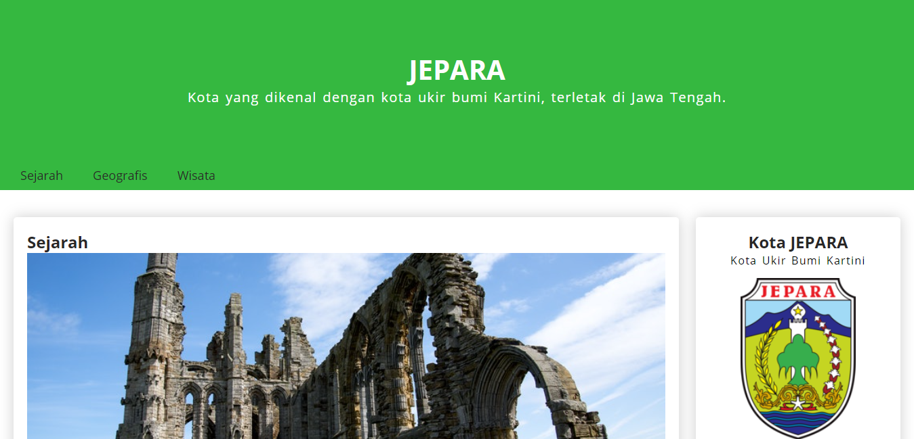

# Submission-Dicoding-Jepara Article
Ini adalah tugas akhir submission dicoding materi Belajar Dasar Pemrograman Website.

## Daftar Isi

-[Overview](#overview)
-[Kriteria Submission](#kriteria-submission)
-[Screenshot](#screenshot)
-[Links](#links)
-[Proses Pembuatan](#proses-pembuatan)
-[Dibuat Dengan](#dibuat-dengan)
-[Dibuat Oleh](#Dibuat-oleh)
-[Ucapan Terima Kasih](#ucapan-terima-kasih)

## overview

### Kriteria Submission

Berikut kriteria submission yang harus Anda penuhi:

- Terdapat elemen <header>, <footer>, <main>, <article>, dan <aside> di berkas HTML.
- Masing-masing elemen wajib berisi konten yang peruntukkannya sesuai dengan elemen tersebut (menerapkan konsep semantic HTML dalam menyusun struktur website).
- Sebagai contoh: Header berisi judul dan navigation. Sedangkan konten artikel tidak boleh berada pada Header.
- Wajib menampilkan identitas diri (biodata diri) yang minimal harus berisi foto asli diri dan nama sesuai profil Dicoding. Identitas diri wajib ditampilkan dalam elemen <aside>.
- Menyusun layout dengan menggunakan float atau flexbox.
- Tema yang ditampilkan bebas, kecuali tema Bandung.
- Semakin detail dan lengkap website Anda maka nilai submission bisa lebih tinggi.
  
  ### Screenshot
  
  
  
  ### Links
  
  -[live Site URL]()
  
  ## Proses
  
  ## Dibuat dengan
  
  - CSS Flexbox
  - Semantic HTML 5 Markup
  - JavaScript
  
  ## Dibuat Oleh
  
  - Instagram - [https://www.instagram.com/anugerah_pangestu/]
  - Facebook - [https://www.facebook.com/nabil.pangestu.359]
  
  ## Ucapan Terima kasih
  - Allah SWT
  - Google Dan Youtube
